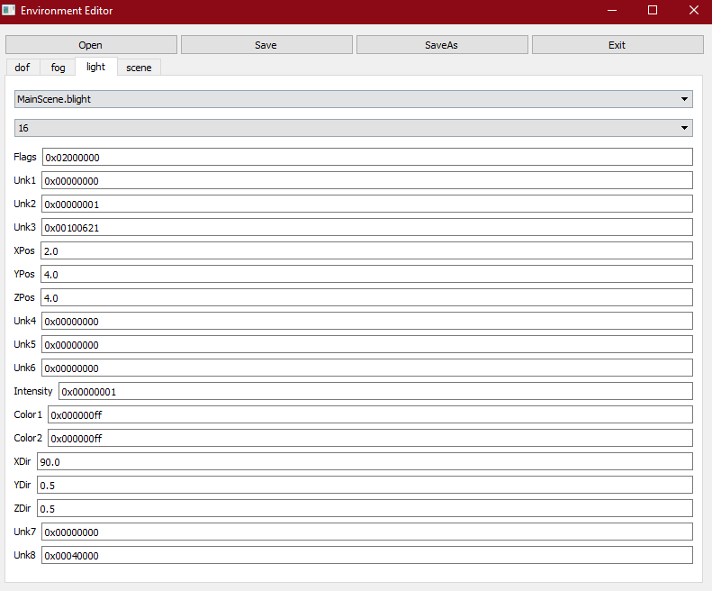
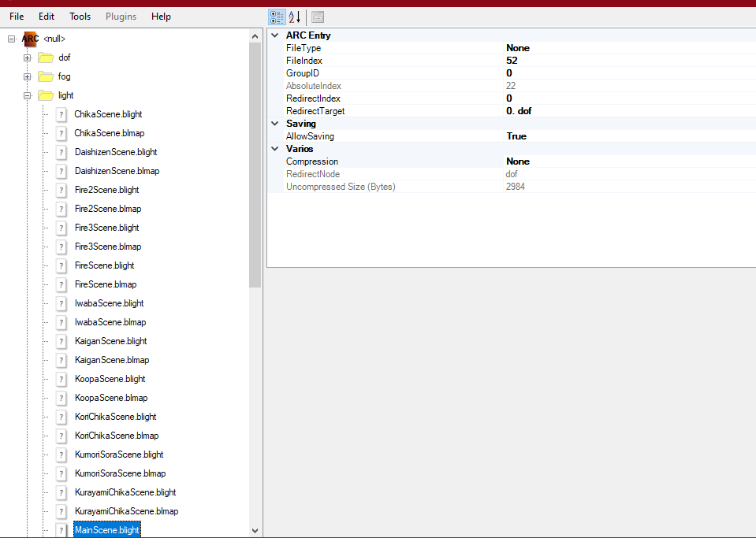
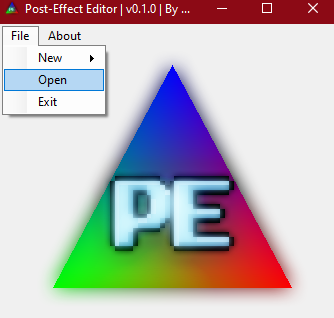
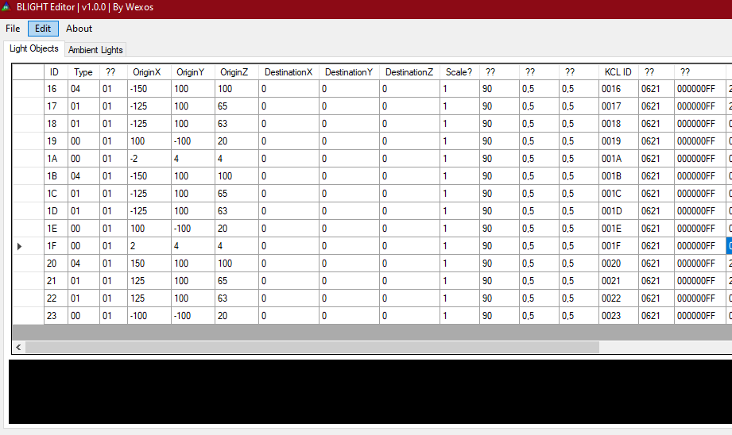

# Environment - English

If you want to change the environment of the game, you must edit this file (`env_course.arc`). It's in the `/Env` folder. 

This file includes everything related to how the game looks.

Inside that file, we'll found some other files. In `/Lights`, we can see some `.blight` files. Those are related to the lighting.

*Add info about the fog files, dof and scenes*

## What program should I use?

We have 2 different programs to use. If we want to change the `fog` or only the `light object`, we must the `EnvEditor`. We can select the whole `course_env.arc` and it will work.

[EnvironmentEditor Updated](https://github.com/RoadrunnerWMC/EnvironmentEditor-Updated)

If run.bat doesn't work, install also this:

[PyQt4-4.11.4-gpl-Py2.7-Qt4.8.7-x64.exe](https://sourceforge.net/projects/pyqt/files/PyQt4/PyQt-4.11.4/PyQt4-4.11.4-gpl-Py2.7-Qt4.8.7-x64.exe)

But, if we want to edit the light (`light object` and `ambient light`), we'd better to use the PE-Editor (Post Effect Editor).

[Post-Effect Editor](http://wiki.tockdom.com/wiki/Post-Effect_Editor)

The PE Editor is done by Wexos, a user with a bad reputation about coding. Another of his projects search throw the IP and name of computer. It's not tested that it does the same with the PE Editor. 

## How can I select a specific environment?

In Reggie, in the zone settings, you can select a lighting (or an environment). Those are the equivalence between what Reggie shows (first columns) and the different files it include:

```
SELECTING SPECIFIC ENVIRONMENTS
00  Overworld           light/MainScene.blight             light/MainScene.blmap              fog/MainScene.bfog
01  Underground         light/ChikaScene.blight            light/ChikaScene.blmap             fog/ChikaScene.bfog
02  Underwater          light/WaterScene.blight            light/WaterScene.blmap             fog/WaterScene.bfog
03  Lava/Volcano (red)  light/FireScene.blight             light/FireScene.blmap              fog/FireScene.bfog
04  Desert              light/SabakuScene.blight           light/SabakuScene.blmap            fog/SabakuScene.bfog
05  Beach               light/KaiganScene.blight           light/KaiganScene.blmap            fog/KaiganScene.bfog
06  Forest              light/DaishizenScene.blight        light/DaishizenScene.blmap         fog/DaishizenScene.bfog
07  Snow Overword       light/YukiDayScene.blight          light/YukiDayScene.blmap           fog/YukiDayScene.bfog
08  Sky (Bonus)         light/SoraScene.blight             light/SoraScene.blmap              fog/SoraScene.bfog
09  Mountains           light/IwabaScene.blight            light/IwabaScene.blmap             fog/IwabaScene.bfog
10  Tower               light/TorideScene.blight           light/TorideScene.blmap            fog/TorideScene.bfog
11  Castle              light/ShiroScene.blight            light/ShiroScene.blmap             fog/ShiroScene.bfog
12  Ghost House         light/ObakeScene.blight            light/ObakeScene.blmap             fog/ObakeScene.bfog
13  River Cave          light/KurayamiChikaScene.blight    light/KurayamiChikaScene.blmap     fog/KurayamiChikaScene.bfog
14  Ghost House Exit    light/ObakeOutScene.blight         light/ObakeOutScene.blmap          fog/ObakeOutScene.bfog
15  Underwater Cave     light/ShinkaiScene.blight          light/ShinkaiScene.blmap           fog/ShinkaiScene.bfog
16  Desert Cave         light/SabakuChikaScene.blight      light/SabakuChikaScene.blmap       fog/SabakuChikaScene.bfog
17  Icy Cave            light/KoriChikaScene.blight        light/KoriChikaScene.blmap         fog/KoriChikaScene.bfog
18  Lava/Volcano        light/Fire2Scene.blight            light/Fire2Scene.blmap             fog/Fire2Scene.bfog
19  Final Battle        light/KoopaScene.blight            light/KoopaScene.blmap             fog/KoopaScene.bfog
20  W8 Castle           light/Fire3Scene.blight            light/Fire3Scene.blmap             fog/Fire3Scene.bfog
21  W8 Doomship         light/KumoriSoraScene.blight       light/KumoriSoraScene.blmap        fog/KumoriSoraScene.bfog
22  Lit Tower           light/Toride2Scene.blight          light/Toride2Scene.blmap           fog/Toride2Scene.bfog
```

## About lighting

The lighting is determined by a specific `.blight` file (see table above). 

There are 2 different lighting:

- `Light object:` This light is applied to a specific group of sprites (probably determined by a z-value group). Changing that light does not have any repercussion with others sprites. There are 36 lights of this kind (0-35).
- `Ambient light:` A light more general. There are 8 (0-7).

Let's explain better what does everyone.

### Lights objects

Every `light object` have **36 different lights**. They are sorted by **groups of 5 lights**. The **first value** of that group is the one that **affects the most**. Let's put an example. ID 6-10 are the responsable of the BgA. From those, editing the ID 6 would make the bgA to look different. But, editing ID 7 doesn't change almost anything. 

This is the list with the IDs and what they change:

```
LIGHT OBJECT ID
06 (soft_M01)  -> BgA
11 (soft_MO01) -> Coins (everykind), palms, bushes, fruits (from Yoshi), signals (->), flags (both), plattforms, switches, "Clowncar (13)", Spike Ball / Snow Ball (63, 98, 109), happy cloud that bounce (78)
16 (soft_P01) -> Players and Yoshi
21 (soft_E01) -> Enemies (Goomba, Koopa and similars), projectils thrown by enemies
26 (soft_B01) -> Unknown
31 (soft_I01) -> Items (mushroop, 1-UP, fire /ice flower, etc...), and models inserter via the Model Spawner (for example, the baloon initial from Newer)
```

### Ambient light

What's about `ambient light`? They do a **global** change, they're like the "sun" in the game. Just that... well, there're different suns. They cannot be edited with the EnvEditor unfortunately. There are only **8 lights (0-7)**.

```
AMBIENT LIGHT ID
00 -> Unknown
01 -> BgA
02 -> Coins, platforms and some sprites
03 -> Players and Yoshi
04 -> Enemies
05 -> Unknown
06 -> Items and models inserted via the Model Spawner
07 -> Unknown
```

## How to use EnvEditor for lighting?

When we have opened the program, we can go to `open` and open our `env_course.arc`. When we have it, we must press  `light` to start editing the lighting. The first step is to select what  `.blight` we want to open (what lighting we have selected in Reggie for that specific zone) (see table above  *SELECTING SPECIFIC ENVIRONMENTS*). 

Then, we see that we have another selector. That's for the light ID (I explained this better above). The list of the IDs of the `light object` is above too (table *LIGHT OBJECT ID*). Remember, the `ambient light` only works with the PE Editor.

Then, you'll have a lot of options to select. You can change the **opacity** from 1 to 0 (it will put the objects grey). You can also change the **color** (it's in hexadecimal). Other options are untested or doesn't change anything.

For example, if we wanted to edit the lighting in overworld, and we wanted to edit the lighting around Mario (ID 16), we should have something similar to this: 



If you want to edit the lighting, the Env Editor is not the best, since it's missing some features. I totally recommend using the PE Editor for lighting. 

## How to use PE Editor for lighting?

For using the PE Editor, first we need to extract the `.blight` that we want. Against how do we open `env_course.arc` with the EnvEditor, the PE Editor doesn't allow us to open the whole `.arc`. 

Instead, we must extract the `.blight` using BrawlCrate or BrawlBox (the `.blight` files are here). 



Then save that file in our computer. We're now ready to open it with the PE Editor. In that program, select file → open, and select our `.blight` file.



We'll se that we have 2 different tabs: **Light Objects** and **Ambient Lights**. 



**Light Objects** works like in the EnvEditor. The left-more column is the ID (in hexadecimal, now) (look the table above to know what ID you must edit, the table called *LIGHT OBJECTS ID*)

About the other columns, some of them are still unknown or not used in nsmbw (because this program was designed for MKW). Still that, you can edit the colors (RED, GREEN, BLUE). Alpha doesn't change anything (probably it's hardcoded).

**Ambient light** is easier, you just have to edit the colors. Again, alpha doesn't work (or, at least, I couldn't found any difference). What does every ID can be found in the table above (*AMBIENT LIGHTS ID).*

## Let's be honest, I just want to do a sillouethe level!

Alright. Then, with the PE Editor, you just have to change every color from every light ID (`light objects` and `ambient lights`) to 00. With that, you'll have your own sillouethe level.

Well, not at all. There are still some problems. BgA isn't completely dark, and BgB isn't changed at all. Also, some sprites are not affected by the lighting (red ring, for example), and the fire/ice ball is as usual. Finally, tilesets are not changed, so you'll have to use a completely black tileset.

All those issues can probably be solved by using fogs, but that would be another day!
