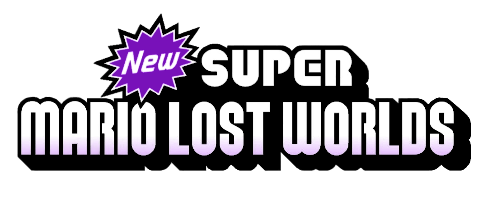

### Introduction

This is a fork of NSMBWer, a slightly modified version of NewerSMBW, which had most of the sprite mods whilst keeping the original game's map system intact and working. A notable change made in NSMBWer is the usage of CodeWarrior and Python 3 for Kamek.

This repo contains further modifications of the game and will hopefully contain the code of an entire
new New Super Mario Bros. Wii Mod with custom 3D maps, over 150 new levels, new backgrounds, new tilesets, new sprites and new music in its' final stage.

[Discord](https://discord.gg/4s72Nnm) - [Trello](https://trello.com/b/W7AgCBky/new-super-mario-lost-worlds) - [YouTube](https://www.youtube.com/channel/UCcIegiv4f0e9-XEUbUiHS7A)

### Licensing

Like in the original repo, the source code and tools are released under the MIT license.
See the `LICENSE` file in this repository for full details.

Copyright (c) 2010-2013 Treeki, Tempus, megazig

Copyright (c) 2020-2021 Nin0, Baddy, Mihi, Bestimum, LiQ, RedStoneMatt, Grop

### Requirements

#### For compiling the Newer game hacks:

* Windows (required for CodeWarrior to run)
* Python 3.x
* Python libraries: PyYAML, pyelftools

#### Compiling this
* Simply execute `- Build -.bat` in the Kamek folder
* You have to edit the path the compiled code will be moved to at the end of the batch script

### What's Here

#### Kamek

All the Newer hacks are inside the Kamek folder in this repository but, technically, Kamek is really just a simple build system for calling the tools to compile/assemble each source file and putting together an output file you can inject into your
game.

Unlike most typical build systems, though, there's a bunch of features specific to game hacks like Newer:

* Kamek is configured through a game-specific project file; each project pulls in various modules, which can each contain C++ and assembly source files, and hooks
* Hooks are different types of patches that are used to inject things into the game: patch static code/data in RAM, overwrite pointers with a reference to a symbol exported from Kamek code, inject branch instructions, ...
* Memory addresses in the linker script and used by hooks are automatically converted to match all supported game versions - Kamek uses the original version of the PAL/European NSMBW release as a reference.
* The compiled output is converted to a specific format expected by the Newer loader.

#### Reggie
* Reggie game patch for NSMLW
* Stage folder containing all tilesets used by the mod

#### Pa0
* Unfinished Pa0 tilesets

#### Other Stuff
Other Stuff includes, well, other stuff:
* Riivolution XML (files load from the NSMBWer - not NSMLW - folder)
* ISO Builder XML (for patching main.dol)
* ObjectPatch (modified Object files for use as a template, some retail levels will still crash due to Nintendo leaving unused nybbles set)
* ReggiePatch (a Reggie patch based on the NewerSMBW one)
